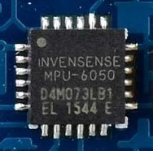
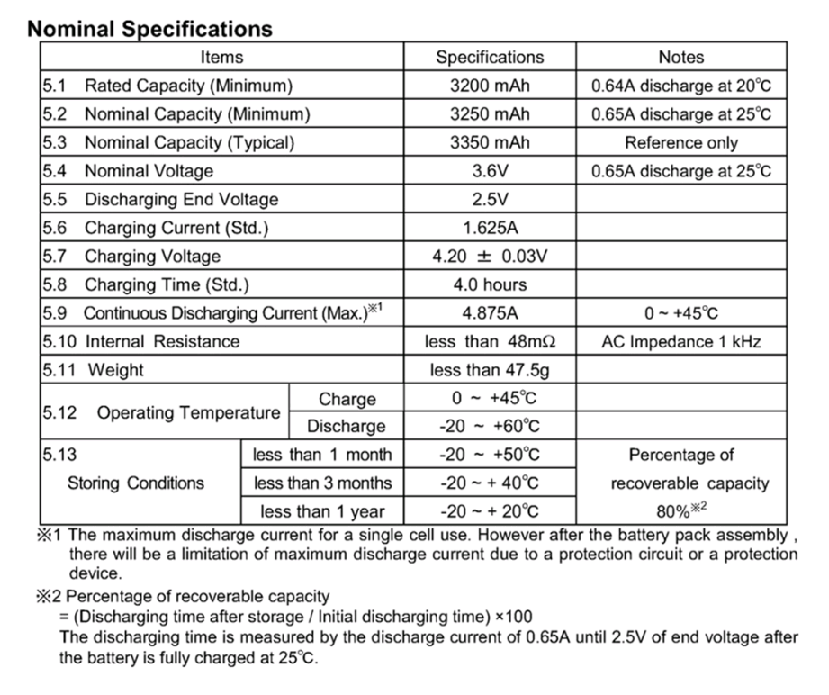
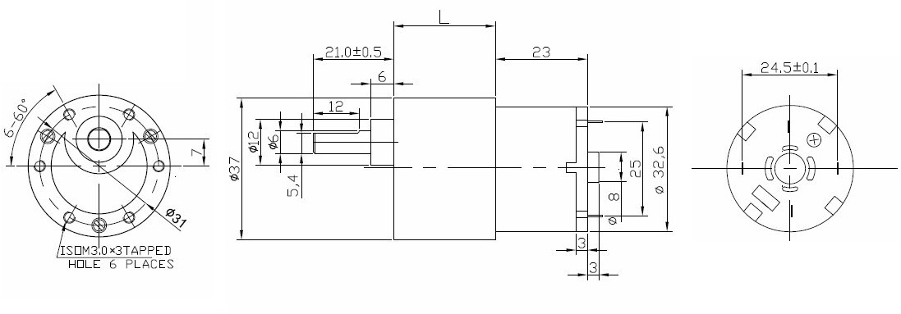

# b1 Mark I - Self Balancing Robot

## Electronics

### Microcontroller
Technical specifications:
- Model: [Arduino Leonardo]

#### Diagram
                                 .-----.
    .----[PWR]-------------------| USB |--.
    |                            '-----'  |
    |                                     |
    |                           A5/SCL[ ] |   C5
    |                           A4/SDA[ ] |   C4
    |                             AREF[ ] |
    |                              GND[ ] |
    | [ ]NC                     SCK/13[ ]~|   B5
    | [ ]v.ref                 MISO/12[ ] |   .
    | [ ]RST                   MOSI/11[ ]~|   .
    | [ ]3V3   +-----+              10[ ]~|   .
    | [ ]5v    |     |               9[ ]~|   .
    | [ ]GND   | MCU |               8[ ] |   B0
    | [ ]GND   |     |                    |
    | [ ]Vin   +-----+               7[ ] |   D7
    |                                6[ ]~|   .
    | [ ]A0                          5[ ]~|   .
    | [ ]A1                          4[ ] |   .
    | [ ]A2                     INT1/3[ ]~|   .
    | [ ]A3                     INT0/2[ ] |   .
    | [ ]A4/SDA  RST SCK MISO     TX>1[ ] |   .
    | [ ]A5/SCL  [ ] [ ] [ ]      RX<0[ ] |   D0
    |            [ ] [ ] [ ]              |
    '--.                         .--------'
       \_______________________/

Arduino Leonardo diagram by http://busyducks.com/ascii-art-arduinos

#### Pin designation
 id | pin |   type    | direction |               description
----|-----|-----------|-----------|--------------------------------------------
  0 |   0 | digital   | input     | Serial communication (and Bluetooth)
  1 |   1 | digital   | output    | Serial communication (and Bluetooth)
  2 |   - | -         | -         | -
  3 |   - | -         | -         | -
  4 |   4 | digital   | input     | Motor A encoder phase
  5 |   5 | digital   | input     | Motor B encoder phase
  6 |   6 | digital   | output    | Motor B direction
  7 |   7 | digital   | output    | Motor B direction
  8 |   8 | digital   | output    | Motor A direction
  9 |   9 | PWM       | output    | Motor B speed
 10 |  10 | PWM       | output    | Motor A speed
 11 |   - | -         | -         | -
 12 |  12 | digital   | output    | Motor A direction
 13 |  13 | PWM       | output    | Status LED
 14 |   - | -         | -         | -
 15 |   - | -         | -         | -
 16 |   - | -         | -         | -
 17 |   - | -         | -         | -
 18 |   - | -         | -         | -
 19 |   - | -         | -         | -

### Digital Motion Processor

[MPU-6050](MPU-6050_DataSheet_V3_4.pdf) datasheet

Technical specifications:
- Model: MPU-6050
- Gyroscope: Yes
- Accelerometer: Yes
- Digital Motion Processor: Yes
- Output Type: I²C, SPI
- Operating Temperature: -40°C ~ 85°C (TA)

### Battery

### Motors
Technical specification:
- Model: GM37-520
- Voltage:
  - Rated: 12 VDC
  - Workable: 6 ~ 15 VDC
- Current:
  - No load: <160 mA
  - Stop: 2.4 A
- Speed:
  - Rated: 160 RPM
  - No load: 240 RPM
  - Reduction Ratio: 1:30
- Torque: 5.5 kg*cm
- Shaft
  - Diameter: 6mm/0.24"
  - Type: D Shape Shaft
- Size:
  - Motor: 33 x 23mm (D x L)
  - Gear: 37 x 22mm (D x L)
- Net Weight: 155g

[Main page]

---
[Main page]: ../README.md
[Arduino Leonardo]: https://www.arduino.cc/en/Main/arduinoBoardLeonardo/#techspecs
